ZRP Validation Experiments' Results
####################################

The following document shares the results of various ZRP validation experiments conducted on different datasets. Note that each validation dataset is a holdout dataset: the ZRP **never** saw/was trained on these data during model development.

The benchmark models used for comparison in this section are BISG and BIFSG. We utilize the surgeo implementations for both models. Across the board, with significant class sizes, we can see ZRP outperforms BISG and BIFSG.

Alabama Voter Registration 
=============================

A validation dataset was constructed using 2021 Alabama voter registration data comprised of about 235,000 randomly sampled records. Around 230,000 records had appropriate data for generating race predictions. Please refer to the *Data Sampling* section to review filtration criteria. The race and ethnicity class information is tabulated below for the Alabama validation dataset. The table include United States popultion estimates by race and ethnicity, these estiamtes are not indicative of the true registered voter population.

+---------------------+----------------+-----------------------+
| Class               | Sample Percent | National Estimate (%) |
+---------------------+----------------+-----------------------+
| Asian American and  |                |                       |
| Pacific Islander    |  1.1%          | 1.6%                  |
+---------------------+----------------+-----------------------+
| American Indian     |                |                       |
| and Alaskan Native  |  0.3%          | 0.7%                  |
+---------------------+----------------+-----------------------+
| African American    |                |                       |
| or Black            |  23.6%         | 26.8%                 |
+---------------------+----------------+-----------------------+
| Hispanic or Latino  |  2.5%          | 4.6%                  |
+---------------------+----------------+-----------------------+
| White               |  72.6%         | 65.3%                 |
+---------------------+----------------+-----------------------+

The benchmark models used for comparison in this section are BISG and BIFSG. We utilize the surgeo implementations for both models. Across the board, with significant class sizes, we can see ZRP outperforms BISG and BIFSG.

**On the Alabama dataset, ZRP labeled more records than other methods**

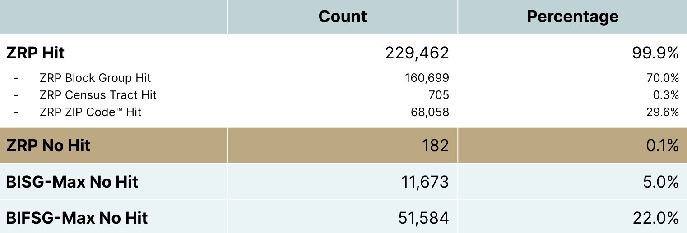
  
BISG falls short when proxying race or ethnicity of minority groups exhibited by low TPRs across  minority classes. Predictive performance of the ZRP model on the Alabama validation dataset is shown below:

**On the Alabama dataset, ZRP is better at predicting race compared to other methods (AUC metric)**

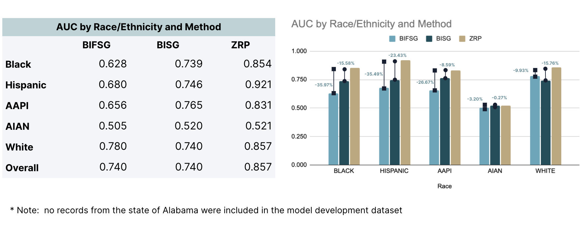

**On the Alabama dataset, ZRP has greater classification accuracy**

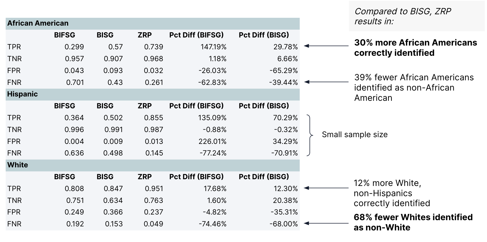

Louisiana Voter Registration 
=============================

**We repeated the Alabama dataset tests on 680,320 Louisiana registered voters.** 

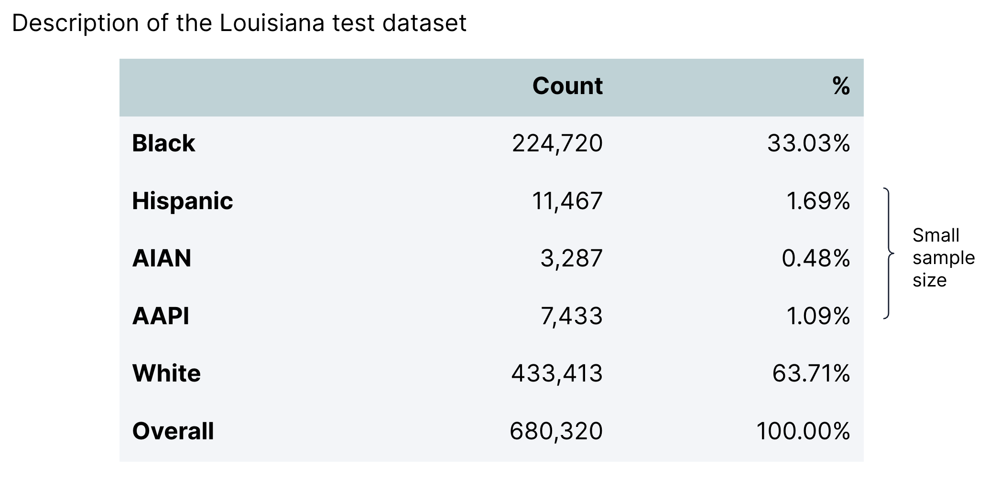

**On the Louisiana dataset, ZRP is better at predicting race compared to other methods (AUC metric)**

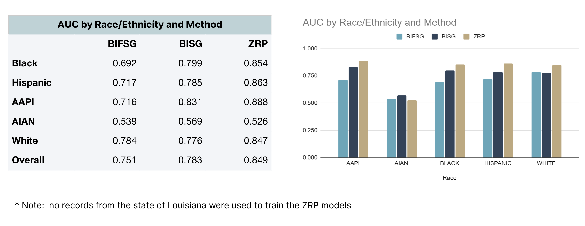

**On the Louisiana dataset, ZRP has greater classification accuracy**

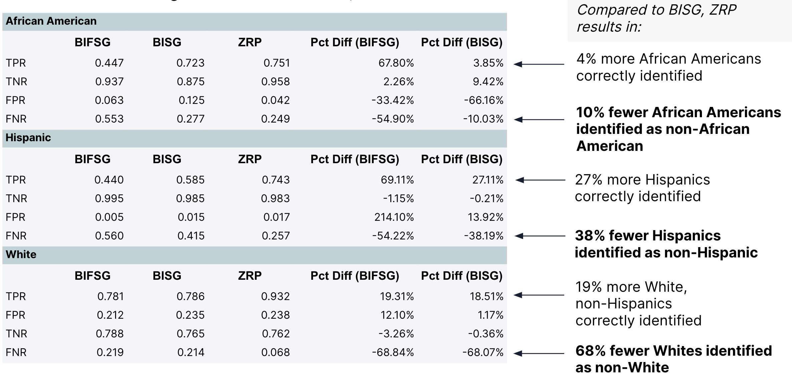

PPP Loan Forgiveness 
=============================

**We repeated the evaluation on a Nationwide dataset comprised of 100,173 owners of small businesses in all 50 states and DC** 

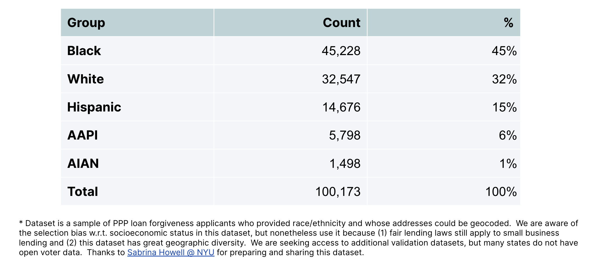

**ZRP provides a more accurate count of protected individuals**

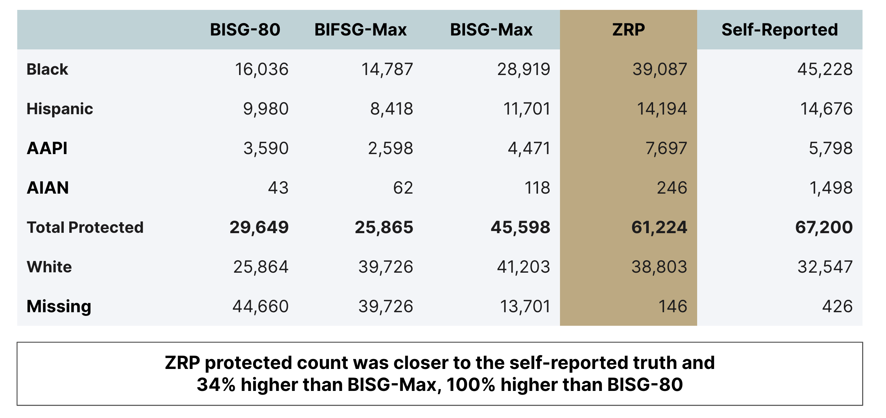
  
**On the PPP dataset, ZRP is better at predicting race compared to other methods (AUC metric)**

.. image:: ppp_aucs.png
  :width: 800
  :alt: Alternative text

**On the PPP dataset, ZRP has greater classification accuracy**

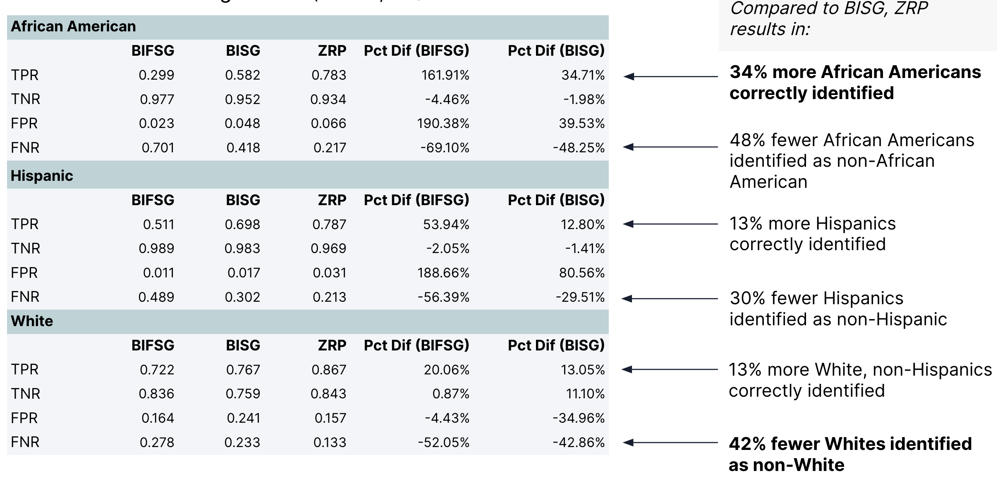
  
  
**ZRP performs well in multiple states**

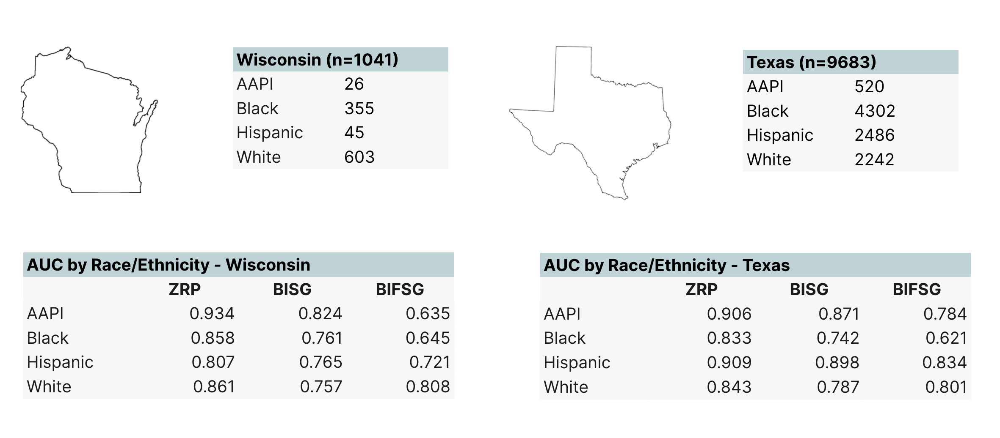
  
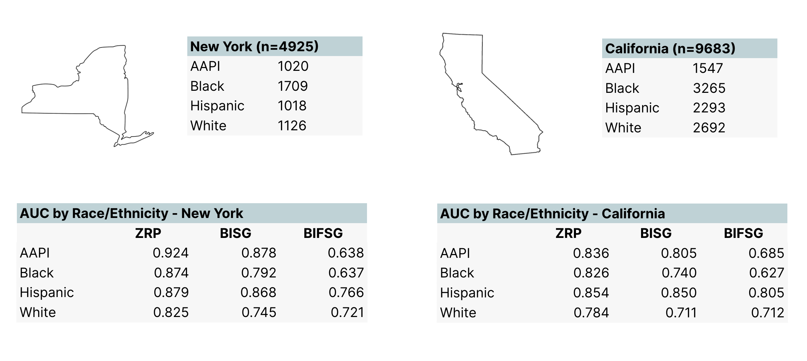
